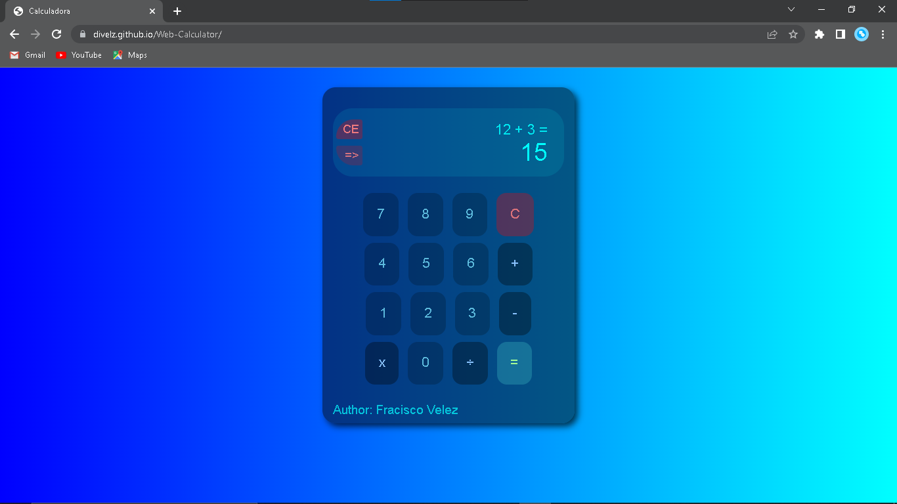

# Web-Question

#4 Project on the web using Html, Css, Javascript. Question fields.

* Boton de cambio de colores.
* Varios campos de opciones.
* Boton de verificar.
* Boton Siguiente para nuevas preguntas.
* Al final tiene el nombre del autor.

**Image 1**

**Image 2**

**Image 3**

**Image 4**

link: [Go to the website.](https://divelz.github.io/Web-Question/)

**Best regard !!!**

<cite>Author: Francisco Velez</cite>
